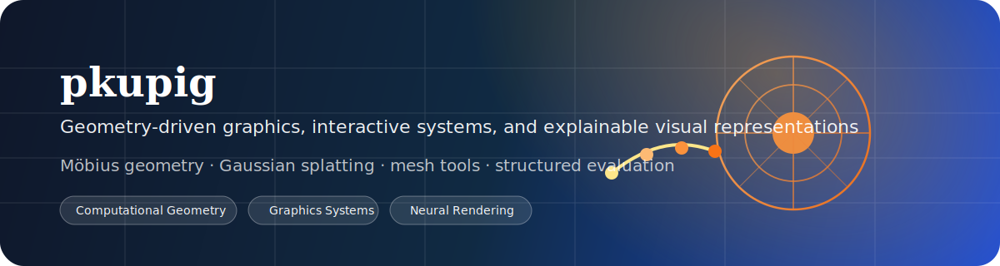
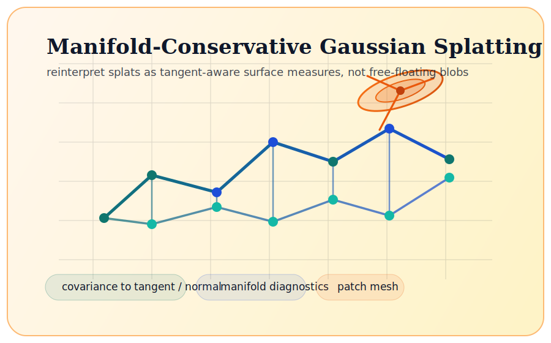

# <div align="center">pkupig</div>

<div align="center">
  
</div>

<div align="center">

`Computational Geometry` `Graphics Systems` `Neural Rendering` `Interactive Tools`

</div>

## About

I work on geometry-driven graphics, explainable visual representations, and interactive systems that are meant to be used rather than just described.

I am especially interested in questions like:

- Can geometric structure directly shape representation and optimization?
- Can a method be explained clearly, not just made to run?
- Can graphics algorithms become interactive, reusable tools instead of isolated demos?

## Featured Projects

<table>
  <tr>
    <td width="52%" valign="top">
      <h3>Mobius Conformal 360</h3>
      <p><strong>Keywords:</strong> Möbius transform / conformal geometry / 360 content / viewport allocation</p>
      <p>This project brings conformal geometry into 360-degree content allocation: a Möbius warp concentrates sampling and bitrate budget around a predicted viewport while preserving local angle structure in the region that matters most.</p>
      <p>What I like about it is that it does not stop at a visual demo. It pushes the geometry into codec evaluation, trace replay, QoE analysis, and offline streaming proxies, so the method is tested in a systems-facing setting.</p>
      <p>
        <a href="https://github.com/pkupig/mobius-conformal-360/blob/main/README.md">README</a> ·
        <a href="https://arxiv.org/html/2606.20684v1">Core Contribution</a> ·
        <a href="https://conformal-360.netlify.app/">Interactive Demo</a>
      </p>
    </td>
    <td width="48%" valign="top">
      
      <br />
      
    </td>
  </tr>
</table>

<table>
  <tr>
    <td width="44%" valign="top">
      
    </td>
    <td width="56%" valign="top">
      <h3>Manifold-Conservative Gaussian Splatting</h3>
      <p><strong>Keywords:</strong> 3DGS / surface-aware representation / manifold projection / assetization</p>
      <p>I do not want to treat 3D Gaussian Splatting as a cloud of free-floating radiance particles. This project tries to reinterpret splats as a discrete geometric measure induced by manifolds.</p>
      <p>The deeper question here is when a set of splats actually behaves like an editable, diagnosable, exportable geometric object, rather than merely producing acceptable rendered images.</p>
      <p>
        <a href="./E-Manifold-GS/README.md">README</a> ·
        <a href="./E-Manifold-GS/FRAMEWORK_ZH.md">Framework ZH</a> ·
        <a href="./E-Manifold-GS/IMPLEMENTATION.md">Implementation</a>
      </p>
    </td>
  </tr>
</table>

<table>
  <tr>
    <td width="54%" valign="top">
      <h3>para_and_defo</h3>
      <p><strong>Keywords:</strong> parameterization / mesh deformation / browser interaction / teaching demo</p>
      <p>This is a compact project I like a lot because it is small but complete: triangle-mesh parameterization and deformation presented as an interactive browser demo, useful both for teaching and as a research prototype.</p>
      <p>It includes ARAP, ASAP, LSCM, and MVC-style parameterization, supports ARAP and Laplacian deformation, and keeps the 3D mesh view synchronized with the 2D parameter-domain view.</p>
      <p>
        <a href="./para_and_defo/defor_param/README.md">README</a>
      </p>
    </td>
    <td width="46%" valign="top">
      
    </td>
  </tr>
</table>

## More Work

Beyond this repository, I also work on several systems with a similar preference for explicit structure:

- `4d`: physics-guided future prediction for sparse 4D occupancy, with emphasis on dynamic prediction and metric-calibrated serialization
- `U-spark`: a matching-system design that combines rules, semantic user profiling, and fine-tuned language models
- `3DARG`: an experimental workspace around generation, editing, and structured metadata

## Working Style

```text
start from structure
  -> build a representation that can be explained
  -> connect it to an evaluation loop
  -> keep the claims honest
```

## Links

- Zhihu: https://www.zhihu.com/people/79-22-17-52-47
- GitHub: https://github.com/pkupig

## Stats

<div align="center">
  
  
</div>
